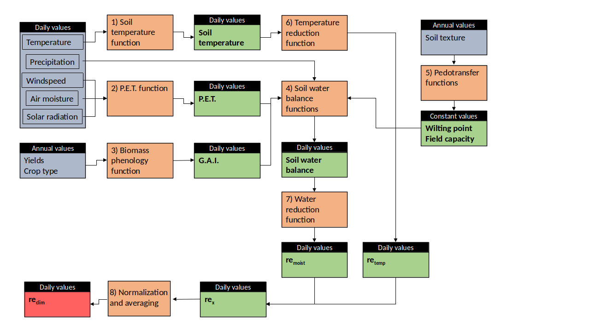

```{r setup, include = FALSE}
knitr::opts_chunk$set(
  collapse = TRUE,
  comment = "#>"
)

library(re)
```

# Introduction
The package `re_clim` is a collection of functions to calculate the climate scaling effect (due to soil moisture and temperature) on the decomposition of soil organic matter (SOC). The functions are intended as companions of the ICBM model [@kattererICBMFamilyAnalytically2001] where they are used to rescale the two pools' kinetics, but can be utilized to rescale any SOC decomposition process kinetic (for example as in @menichettiGenericParametersFirstorder2019 where the same scaling has been applied to the microbial kinetic term in the Q decomposition model) or to normalize for the effects of such covariates in laboratory studies.  
The calculation presented here can be easily updated by substituting specific functions with alternatives (for example by considering local pedotransfer funcitons in case this would be more appropriate), but this would require to follow the calculations steps manually and not using the main wrapper function `reclim`  
In this vignette we will first describe the steps of the calculation, and then introduce an example of possible usage, based on an example dataset. Please refer to the package manual for more specific details.  

# The steps in the calculation
{width=80%}

## Soil temperature 

The soil temperature is calculated from the air temperature according to @kattererPredictingDailySoil2009. The calculation is based on an semi-empirical model considering heat transfer according to:
$T_t(z) = T_{t-1}(z)+[T_{surf}-T_{t-1}(z) \cdot e^{-z \left( \frac{\pi}{k_sp} \right)^\frac{1}{2} } \cdot e^{-k_{LB} LAI_t}$. 

where $t$ is time (day), $Tsurf$ is the apparent temperature at the soil surface, $k_s$ is the thermal diffusivity (cm$^2$ s$^{-1}$), $p$ is the period of temperature variation ($s$, in this case one year), and $k_{LB}$ is the radiation extinction coefficient according to Lambert-Beer’s Law, which governs the radiation transfer between atmosphere and soil as a function of leaf area (LAI) or an equivalent thickness of litter on the soil surface.  
Please note that the soil temperature model calculates each time step based also on the previous (based on the idea of energy balance.)

## Biomass phenology functions (G.A.I. estimates)
The biomass growth functions are different for each of the class considered by the calculation, which are:
```{r, echo=FALSE} 
c("spring_small_grains", "spring_oil_seeds","winter_small_grains", "winter_oil_seeds","root_crop")
```
Plus four additional experimental classes with specific functions;
```{r, echo=FALSE} 
c("fodder", "fodder_maize", "ley", "missing")
```
The latter were added during the last revision of the function and are still experimental features (in particular ley).
The function is used to simulate the development of crops and their green area index (G.A.I.). The function uses among the inputs a vector of different crops, which will be simulated with different parameters.
The function loops in annual steps through the years of the simulation and then runs a nested loop to simulate the crop growth in daily steps. 
The functions returns also the LAI, calculated as $0.8 \cdot GAI$ until maximum GAI. After maximum GAI, before harvest the LAI is set to never fall below $0.7 \cdot max(LAI)$, and between harvest and tillage never below $0.2 \cdot max(LAI)$ according to Kätterer & Andrén 2009.
First of all the function checks if the crop of that year is not "fodder", "fodder maize" or "ley". if not, then sets the maximum GAI (j is the index used in the main function loop, looping through the simulation years):
$GAI_{max}=0.0129 \cdot (\frac{yield_j}{1000})^2 + 0.1964 \cdot(\frac{yield_j}{1000})$
For root crops the maximum GAI is set differently (see below the specific section).  The function then proceeds to simulate the growth according to a gausssian function subsequently modified. The gaussian function is controlled by the parameters defining where it is centered and its variance. Its center is calculated according to seeding and harvest dates, which are in the input data. Then the GAI outside the area covered by such function is either set to zero or to the minimum coverage specified in the input data.
The main function used to simulate the crop growth, after first having calculated the center of the gaussian with
$middle=seeding_j + \frac{harvest_j-seeding_j}{2}$
is the following:
$GAI=GAI_{max} \cdot exp(-\frac{(day-middle)^2)}{(2\cdot variance_j)})$
Most crops are considered covering the soil even after being fully mature, except root crops fodder (including silage maize). Please not that this does not imply that such crops are returned as C inputs to the soil in the ICBM model, this
concerns just the calculation of the climatic reduction coefficients.

### Specific crop functions
Root crops have a specific function, which is based on the average yields (yield_vec) and maximum LAI (LAI_max_vec) obtained in the Ultuna experiment during the three years when root crops were planted.
The maximum GAI is also calculated with a different function:
$GAI_{max}=min(5.6,\frac{1}{0.8} \cdot mean(\frac{LAI_max_vec}{yield_vec}) \cdot \frac{1}{0.75} \cdot yield_j)$

For fodder, the maximum GAI is calculated according to data for fodder rape (https://www.agronomysociety.org.nz/files/2010_11._Seed_yield_of_forage_rape.pdf)
$GAI_{max}=min(10,0.0004615385 \cdot yield_j)$


For silage (fodder) maize, the maximum GAI is calculated according to data from the Ultuna experiment, where silage maize has been planted since 2000
$GAI_{max}=min(10,\frac{1}{0.8} \cdot 0.000533 \cdot yield_j)$

Leys are complicated by the fact that there might be two subsequent cuts, so two harvests. The command considers this possibility with 2 optional parameters, harvest2 and yields2, which are otherwise set to NULL.
If these two parameters are present another if condition takes care of them when they are not set to zero.


## Potential evapotranspiration
The evapotranspiration is calculated according to @allenCropEvapotranspirationGuidelines. Specifically, the potential evapotranspiration (PET or $ET_0$ according to FAO terminology) is calculated based on radiation, air temperature, humidity and wind speed according to the Penman-Monteith equation. The function implemented in this package can utilize either direct solar radiation (energy, MJ m$^{-2}$ day$^{-1}$) measurements, or sunlight/cloudiness.

## Soil water balance
The steps of the calculation are already described in the package manual, but here we will examine some of them in more detail.  
  
Step 1: Soil water W is initialized assuming saturation, based on the depth L and volumetric capacity  
$W[1] = \Theta_f \cdot L$  
 
Step 2: The single crop coefficient Kc is calculated based on GAI  
$K_c=1.3-0.5 \cdot exp(-0.17 \cdot GAI)$  
  
Step 3: calculation of crop evapotranspiration (ETc) under standard condition  
$ET_c=ET_0 \cdot K_c$  
Step 4:  the intercepted water It is calculated based on crop ET, GAI and precipitation P  
$It=min(P,ET_c,0.2 \cdot GAI)$  
  
Step 5:  potential evapotraspiration is calculated  
$E_{pot}=(ET_c-It)$  
  
Step 6:  Calculation of the percolation. Water (W_b, water bypass) is lost when above field capacity, but allowing saturation for one day  
$W_b = max(0, W-(\Theta_f \cdot L))$  
  
Step 7:  Soil evaporation reduction coefficient  
$Kr=\left(1-\frac{0.95 \cdot \Theta_{field}-\Theta}{0.95 \cdot \Theta_{field}-\alpha \cdot \Theta_{wilt}}\right)^2$  
This function expresses the actual evaporation, and in it it is considered that even below wilting point there is some biological activity. The function is zero below wilting point.  
A subsequent conditions is applied so that Kr cannot be above one.  
  
Step 8:  Actual evapotraspiration is calculated  
$E_{act}=E_{pot} \cdot Kr$    

Step 9:  The water balance is calculated (stepwise)  
$W[i+1]=W[i]+P[i]-E_{act}[i]-It-W_b[i]$  

## Pedotransfer functions
Pedotransfer functions are calculated according to @kattererPredictingDailySoil2009


## Temperature reduction function
The temperature reduction function is taken from @10.1007/s003740050430
```{r, fig.height = 4, fig.width = 4} 
Temp_soil=seq(from=-10, to=30, by=0.1)
re_temp=re_temperature(Temp_soil)
plot(Temp_soil, re_temp, main="Shape of the temperature reduction function", type="l", col="firebrick1", lwd=2)
```


## Water reduction function
The water reduction function was updated form previous ICBM iterations with a function able to represent also the reduction in activity with approaching soil saturation, according to moyanoMoistureResponseSoil2012

The temperature reduction function is taken from @10.1007/s003740050430
```{r, fig.height = 4, fig.width = 4} 
Water_soil=seq(from=0, to=10, by=0.1)
re_moist=re_water(twilt=0.2, tfield=0.5, water=Water_soil, porosity=0.7, L=20)
plot(Water_soil, re_moist, main="Shape of the moisture reduction function", type="l", col="firebrick1", lwd=2)
```

## Normalization and averaging
The terms from the two reduction functions are multiplied as $r_{x_1} = r_{temp} \cdot r_{moist}$, and the term  $r_{x_1}$ is then rescaled so that the treatment G of the Ultuna long term frame trial (@andrenICBMINTRODUCTORYCARBON1997) to obtain the scaled value $r_e=r_{x_1} \cdot 0.1056855$. This particular experiment is where the kinetics of the ICBM model were initially calibrated, and the G treatment is the one approximating the equilibrium.  
The scaling can be adapted to different models or sites, if needed, provided that the calibration is updated. 

# Example 
First we need to install the package from its GitHub repository, for which we need to rely on the package `devtools`.  

```{r,  include = FALSE} 
#installing the R package
library(devtools)
#install_github("ilmenichetti/reclim", force=T)

#load the package
library(re)
library(plyr)
library(RColorBrewer)

```

We can then proceed to load the test site data and reorganize them averaging by treatment (since in this example we are interested in calculating the average $r_clim$ factor. The test data are included in the /data folder of this package.

Now we run the reclim command to calculate the r_clim factor:
```{r} 
# #calculate the re_clim (daily values, all treatments)
Test_reclim_out<-reclim(weather=weather_testdata,
                         aboveground=aboveground_testdata,
                         latitude=58,
                         altitude=83,
                         sand=8,
                         clay=43,
                         ave_SOC=1.9,
                         depth=20,
                         sun.mode="Rsolar")
```
Ok, the calculation seems to be running.  
  
The output of the function is fairly complicated list with most outputs from the internal functions. We can for eample have a look at the structure of the rescaled $r_clim$ value, which is usually the main target value:

```{r} 
str(Test_reclim_out$re_x1)
```

Now we can try to plot some of the values we calculated, for example the GAI simulation:
  
```{r, fig.height = 6, fig.width = 7} 
crop_id_used<-unique(Test_reclim_out$crop_id)
palette_crop_id_used<-brewer.pal(length(crop_id_used), "Dark2")

plot(Test_reclim_out$PET$date, Test_reclim_out$GAI[2,], type="l", ylim=c(0, max(Test_reclim_out$GAI[2,])*1.3), xlab="date", ylab="GAI")

#coloring the output based on the crop
for(i in 1:length(crop_id_used)){
  which_ones<-which(!Test_reclim_out$crop_id==crop_id_used[i])
  GAI_crop<-Test_reclim_out$GAI[2,]
  GAI_crop[which_ones]<-NA
  lines(Test_reclim_out$PET$date, GAI_crop, col=palette_crop_id_used[i])
}
legend("topright", as.character(crop_id_used), col=palette_crop_id_used, bty="n", lty=1)
```
  
```{r,fig.height = 4, fig.width = 7} 
plot(Test_reclim_out$PET$date, Test_reclim_out$re_crop[1,], type="l",xlab="date", ylab="r", main="First treatment (CONVENTIONAL)")
```
  
The package includes also a function to calculate the annual averages from the inputs of the main function:

```{r} 

#calculate annual re-clim values
Test_annual<-reclim_annual(Test_reclim_out$results_daily)
where_re_crop<-grepl("re_crop.", as.character(colnames(Test_annual)))
Test_annual_re_crop<-(Test_annual[where_re_crop])
```


```{r,fig.height = 4, fig.width = 7} 
plot(Test_annual_re_crop$re_crop_treat.CONVENTIONAL, type="l",xlab="year", ylab="r", main="First treatment (CONVENTIONAL)")
```

# References
